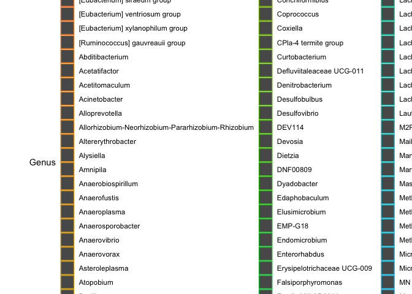

**Bad Plot/Good Plot**
================

# Open libraries

``` r
library(tidyverse)
library(viridis)
library(phyloseq)
```

# Data set

This data set is huge.

``` r
summarize_genusgrp <- read.csv("summarizedtest.csv")
```

# Bad plot

This plot is horrendous. The color scheme is actually impossible to
determine different communities, and what do the axes even represent? It
says relative abundance, but with all of these communities listed, we
can’t exactly tell if this makes up the “whole community”. Why are the
standard deviations so off? How can they be oriented that way?

This plot breaks Tufte’s (section 2) principle of presenting correct
data. This data is presented in a way that can be overall confusing, and
not entirely accurate. You have no knowledge of what the intention is
for this plot. With all the communities split up as so, it’s not
informative at all. Additionally, this brings in Tufte’s (section 3)
idea that there should be some quantitative evidence for the plot. Here,
we see that we have standard deviation bars. These bars were created
arbitrarily, in sort… no NAs were removed for this, and there were
multiple communities that had ‘0’ abundance. This means that the
standard deviation bars really represent almost nothing for these, and
you wouldn’t truly know that without asking how it was made (you may
have had the suspicion, from some of the negative SD bars). This plot
has a ton of information on it, however - Tufte was a fan of that\! You
can see the treatment groups, but.. what even do the treatment groups
show? You can’t gain any knowledge from this, due to the way the
treatment group has been
plotted.

``` r
bp <- ggplot(data = summarize_genusgrp, aes(x = Genus, y = meanRA, fill = TRT))
bp + geom_bar(aes(color = Genus, alpha = 0.5), stat="identity", position="stack") +
  scale_y_continuous(name = "Mean Relative Abundance") +
  theme(legend.position = "bottom") +
  geom_errorbar(aes(x = Genus, ymin = meanRA-sdRA, ymax = meanRA+sdRA), width = 0.5, color = "orange", alpha = 0.9, size = 1.0) 
```

<!-- -->


# Phyloseq

Necessary for my “good plot”.

metadata \<- read.csv(“metadata.csv”) seqtab.nochim \<-
read.csv(“seqtabnochim.csv”) sample\_data \<-
read.csv(“sampledata.csv”) taxa \<- read.csv(“taxa.csv”) ps \<-
merge\_phyloseq(otu\_table(seqtab.nochim, taxa\_are\_rows=FALSE),
sample\_data(metadata), sample\_names(sample\_data), tax\_table(taxa))
dna \<- Biostrings::DNAStringSet(taxa\_names(ps)) names(dna) \<-
taxa\_names(ps) ps \<- merge\_phyloseq(ps, dna) taxa\_names(ps) \<-
paste0(“OTU”, seq(ntaxa(ps))) ps tax.clean \<-
data.frame(tax\_table(ps.f)) for(i in 1:6){ tax.clean\[,i\] \<-
as.character(tax.clean\[,i\])} tax.clean\[is.na(tax.clean)\] \<- "" for
(i in 1:nrow(tax.clean)) { if(tax.clean\[i,2\] == "“){ kingdom \<-
paste(”Kingdom\_“, tax.clean\[i,1\], sep =”“) tax.clean\[i,2:6\] \<-
kingdom } else if (tax.clean\[i,3\] ==”“){ phylum \<- paste(”Phylum\_“,
tax.clean\[i,2\], sep =”“) tax.clean\[i, 3:6\] \<- phylum } else if
(tax.clean\[i,4\] ==”“){ class \<- paste(”Class\_“, tax.clean\[i,3\],
sep =”“) tax.clean\[i, 4:6\] \<- class } else if (tax.clean\[i,5\]
==”“){ order \<- paste(”Order\_“, tax.clean\[i,4\], sep =”“)
tax.clean\[i, 5:6\] \<- order } else if (tax.clean\[i,6\] ==”“){ family
\<- paste(”Family\_“, tax.clean\[i,5\], sep =”") tax.clean\[i, 6:6\] \<-
family } } tax\_table(ps.f) \<- as.matrix(tax.clean)

# Good plot

If you’d like to make a “better” standard barplot, you could do
something along the lines of this. I would not argue that this is the
best option, but the best option is a little over my head right now (I’d
prefer some kind of geom\_boxplot). We can see the top 10 genera, for
each treatment. At least here, we also use colorblind friendly colors as
well with the viridis package.

ps1g.10 \<- merge\_samples(ps.f, “TRT”) ps1g.10 \<-
transform\_sample\_counts(ps1g.10, function (x) 100\* x / sum(x))
ps2g.10 \<- tax\_glom(ps1g.10, “Genus”, NArm=TRUE) top\_genus.10 \<-
names(sort(taxa\_sums(ps2g.10), decreasing = TRUE)\[1:10\]) ps3g.10 \<-
prune\_taxa(top\_genus.10, ps2g.10) dfg.10 \<- psmelt(ps3g.10)

abundplotgenus.10 \<- ggplot(dfg.10, aes(Sample, Abundance, fill =
Genus)) + geom\_bar(stat=“identity”) + scale\_fill\_viridis(discrete =
TRUE) + ylab(“Relative Abundance (%)”) + theme\_bw() + theme(axis.text.x
= element\_text(angle = 360)) + xlab(“Dosing Frequency”) + ggtitle(“Top
10 genera”) + theme(legend.position = “bottom”) +
guides(fill=guide\_legend(nrow=5))

abundplotgenus.10


