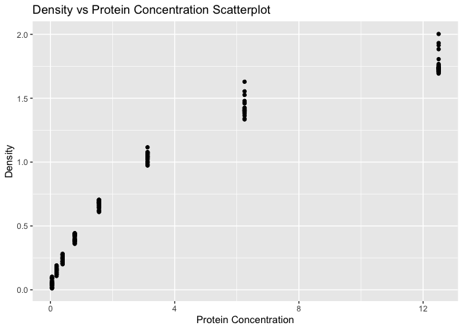
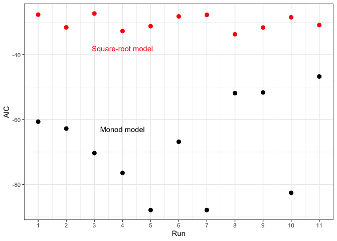

*HW8*
================

# Open libraries

``` r
library(tidyverse)
library(nls2)
library(broom)
```

## Question 1

# 

Using the diamonds data set, make a data frame that shows the slope of
the relationship of price as a function of weight (carat) for each
unique color, in decreasing order of slope.

``` r
dia_list <- diamonds %>%
  split(.$color) %>%
  map(~lm(price ~ carat,data=.)) %>%
  map(coefficients) %>%
  map_dbl("carat")

dia_list_temp <- dia_list[order(desc(dia_list))]
colnames <- c("Color","Price/Carat Slope")
dia_df <- as.data.frame(dia_list_temp)
names(dia_df)[1] <- "Price/Carat Slope"
knitr::kable(dia_df)
```

|   | Price/Carat Slope |
| :- | ----------------: |
| F |          8676.658 |
| G |          8525.346 |
| D |          8408.353 |
| E |          8296.213 |
| I |          7761.041 |
| H |          7619.098 |
| J |          7094.192 |

## Questions 2

# Scatterplot

``` r
#head(DNase)
ggplot() +
  geom_point(data=DNase, aes(x = conc, y = density)) +
  labs(  x = "Protein Concentration", 
         y = "Density",
        title = "Density vs Protein Concentration Scatterplot")
```

<!-- -->

# Combination

I added geom\_smooth out of curiosity to see what the data looked like,
but it wasn’t necessary in making the final determination of the model.

``` r
# Nest data
by_run <- DNase %>%
  group_by(Run) %>%
  nest()

# Write functions for the two models
sqrt.mod <- function(df) {
  nls2(formula(density ~ beta_1 * sqrt(conc) + beta_0),
        data = df,
        start = list(beta_1 = 0.5, beta_0 = 0.1))
}

monod.mod <- function(df) {
  nls2(formula(density ~ (conc * beta_1)/(conc + beta_0)),
       data = df,
       start = list(beta_1 = 2, beta_0 = 0.5))
}


# Apply my two models to every group in my data frame

sqrt_models <- map(by_run$data, sqrt.mod)
monod_models <- map(by_run$data, sqrt.mod)

# Add the lists of models to my data frame

by_run <- by_run %>%
  mutate(sqrt.model = map(data, sqrt.mod), 
         monod.model = map(data, monod.mod))
by_run
```

    ## # A tibble: 11 x 4
    ## # Groups:   Run [11]
    ##    Run   data              sqrt.model monod.model
    ##    <ord> <list>            <list>     <list>     
    ##  1 1     <tibble [16 × 2]> <nls>      <nls>      
    ##  2 2     <tibble [16 × 2]> <nls>      <nls>      
    ##  3 3     <tibble [16 × 2]> <nls>      <nls>      
    ##  4 4     <tibble [16 × 2]> <nls>      <nls>      
    ##  5 5     <tibble [16 × 2]> <nls>      <nls>      
    ##  6 6     <tibble [16 × 2]> <nls>      <nls>      
    ##  7 7     <tibble [16 × 2]> <nls>      <nls>      
    ##  8 8     <tibble [16 × 2]> <nls>      <nls>      
    ##  9 9     <tibble [16 × 2]> <nls>      <nls>      
    ## 10 10    <tibble [16 × 2]> <nls>      <nls>      
    ## 11 11    <tibble [16 × 2]> <nls>      <nls>

# Extracting AIC values by run

``` r
models_by_run <- by_run %>%
  mutate(glance.sqrt = map(sqrt.model, broom::glance),
         glance.monod = map(monod.model, broom::glance)) %>%
  unnest(c(glance.sqrt, glance.monod), .drop = TRUE)
```

    ## Warning: The `.drop` argument of `unnest()` is deprecated as of tidyr 1.0.0.
    ## All list-columns are now preserved.

``` r
summary <- models_by_run %>%
  select(Run, AIC, AIC1)
```

# Plotting AIC values

``` r
ggplot(summary) +
  geom_point(aes(x = as.integer(Run), y = AIC), size = 2.5, color = "red") +
  geom_point(aes(x = as.integer(Run), y = AIC1), size = 2.5) +
  annotate("text", x = 4, y = -38, label = "Square-root model", color = "red") +
  annotate("text", x = 4, y = -63, label = "Monod model") +
  scale_x_continuous(name = "Run", breaks = c(1:11)) +
  theme_bw()
```

<!-- -->

# Determination of best model

The lowest AIC value usually means the better quality of the model. For
this, the most negative value for AIC was the monod model, meaning that
it best fits the data.
