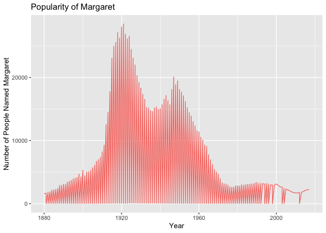

*HW3*
================

# Open libraries

Open library and data that we want to work
    with.

``` r
library(tidyverse)
```

    ## ── Attaching packages ─────────────────────────────────────── tidyverse 1.3.0 ──

    ## ✓ ggplot2 3.3.3     ✓ purrr   0.3.4
    ## ✓ tibble  3.0.6     ✓ dplyr   1.0.4
    ## ✓ tidyr   1.1.2     ✓ stringr 1.4.0
    ## ✓ readr   1.4.0     ✓ forcats 0.5.1

    ## ── Conflicts ────────────────────────────────────────── tidyverse_conflicts() ──
    ## x dplyr::filter() masks stats::filter()
    ## x dplyr::lag()    masks stats::lag()

``` r
install.packages("babynames",repos = "http://cran.us.r-project.org")
```

    ## 
    ## The downloaded binary packages are in
    ##  /var/folders/cl/bdv1p6fd49100qw1_8q_yq9c0000gn/T//RtmppfUeqr/downloaded_packages

``` r
library(babynames)
```

# Separate data for use

Examine the dataset, then decide what our hypothesis will be. For mine,
I predict that the name Margaret’s usage will decrease with time.

``` r
glimpse(babynames)
```

    ## Rows: 1,924,665
    ## Columns: 5
    ## $ year <dbl> 1880, 1880, 1880, 1880, 1880, 1880, 1880, 1880, 1880, 1880, 1880…
    ## $ sex  <chr> "F", "F", "F", "F", "F", "F", "F", "F", "F", "F", "F", "F", "F",…
    ## $ name <chr> "Mary", "Anna", "Emma", "Elizabeth", "Minnie", "Margaret", "Ida"…
    ## $ n    <int> 7065, 2604, 2003, 1939, 1746, 1578, 1472, 1414, 1320, 1288, 1258…
    ## $ prop <dbl> 0.07238359, 0.02667896, 0.02052149, 0.01986579, 0.01788843, 0.01…

``` r
margaret <- babynames %>%
  select(year, name, n) %>%
  filter(name %in% "Margaret")
glimpse(margaret)
```

    ## Rows: 257
    ## Columns: 3
    ## $ year <dbl> 1880, 1881, 1881, 1882, 1882, 1883, 1883, 1884, 1884, 1885, 1885…
    ## $ name <chr> "Margaret", "Margaret", "Margaret", "Margaret", "Margaret", "Mar…
    ## $ n    <int> 1578, 1658, 9, 1821, 7, 1881, 13, 2142, 10, 2204, 11, 2275, 8, 2…

# Plotting

Plot the dataset.

``` r
ggplot(data = margaret, aes(x = year, y = n, color = "name")) +
  geom_line() +
  labs (title = "Popularity of Margaret", x = "Year", y = "Number of People Named Margaret") +
  theme(legend.position = "none")
```

<!-- -->

# Results

The name Margaret peaks around the 1920s and then decreases, and the
nincreases again around the 50s. The name becomes less and less
frequently observed by the 2000s.
