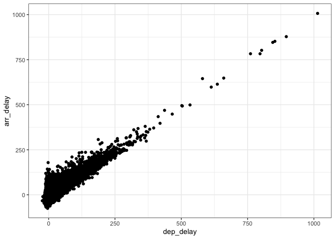

*Homework 4*
================

# Calculate the sum of 2 and 3 as follows:

Assign the value 3 to a variable called a. Assign the value 2 to a
variable called b. Print the sum of a and b.

``` r
a <- 3
b <- 2
a + b
```

    ## [1] 5

Calculate the sum of 2 and 3 using the sum() function.

``` r
sum(2, 3)
```

    ## [1] 5

# Flights plotting

Open the flights data frame and make a scatterplot of arrival delay
versus departure delay, for only American Airline
    flights.

``` r
library(tidyverse)
```

    ## ── Attaching packages ─────────────────────────────────────── tidyverse 1.3.0 ──

    ## ✓ ggplot2 3.3.3     ✓ purrr   0.3.4
    ## ✓ tibble  3.0.6     ✓ dplyr   1.0.4
    ## ✓ tidyr   1.1.2     ✓ stringr 1.4.0
    ## ✓ readr   1.4.0     ✓ forcats 0.5.1

    ## ── Conflicts ────────────────────────────────────────── tidyverse_conflicts() ──
    ## x dplyr::filter() masks stats::filter()
    ## x dplyr::lag()    masks stats::lag()

``` r
library(nycflights13)
glimpse(flights) # Checking var names
```

    ## Rows: 336,776
    ## Columns: 19
    ## $ year           <int> 2013, 2013, 2013, 2013, 2013, 2013, 2013, 2013, 2013, …
    ## $ month          <int> 1, 1, 1, 1, 1, 1, 1, 1, 1, 1, 1, 1, 1, 1, 1, 1, 1, 1, …
    ## $ day            <int> 1, 1, 1, 1, 1, 1, 1, 1, 1, 1, 1, 1, 1, 1, 1, 1, 1, 1, …
    ## $ dep_time       <int> 517, 533, 542, 544, 554, 554, 555, 557, 557, 558, 558,…
    ## $ sched_dep_time <int> 515, 529, 540, 545, 600, 558, 600, 600, 600, 600, 600,…
    ## $ dep_delay      <dbl> 2, 4, 2, -1, -6, -4, -5, -3, -3, -2, -2, -2, -2, -2, -…
    ## $ arr_time       <int> 830, 850, 923, 1004, 812, 740, 913, 709, 838, 753, 849…
    ## $ sched_arr_time <int> 819, 830, 850, 1022, 837, 728, 854, 723, 846, 745, 851…
    ## $ arr_delay      <dbl> 11, 20, 33, -18, -25, 12, 19, -14, -8, 8, -2, -3, 7, -…
    ## $ carrier        <chr> "UA", "UA", "AA", "B6", "DL", "UA", "B6", "EV", "B6", …
    ## $ flight         <int> 1545, 1714, 1141, 725, 461, 1696, 507, 5708, 79, 301, …
    ## $ tailnum        <chr> "N14228", "N24211", "N619AA", "N804JB", "N668DN", "N39…
    ## $ origin         <chr> "EWR", "LGA", "JFK", "JFK", "LGA", "EWR", "EWR", "LGA"…
    ## $ dest           <chr> "IAH", "IAH", "MIA", "BQN", "ATL", "ORD", "FLL", "IAD"…
    ## $ air_time       <dbl> 227, 227, 160, 183, 116, 150, 158, 53, 140, 138, 149, …
    ## $ distance       <dbl> 1400, 1416, 1089, 1576, 762, 719, 1065, 229, 944, 733,…
    ## $ hour           <dbl> 5, 5, 5, 5, 6, 5, 6, 6, 6, 6, 6, 6, 6, 6, 6, 5, 6, 6, …
    ## $ minute         <dbl> 15, 29, 40, 45, 0, 58, 0, 0, 0, 0, 0, 0, 0, 0, 0, 59, …
    ## $ time_hour      <dttm> 2013-01-01 05:00:00, 2013-01-01 05:00:00, 2013-01-01 …

``` r
AA_flights <- flights %>%
  filter(carrier == "AA")
glimpse(AA_flights) # Check that it worked
```

    ## Rows: 32,729
    ## Columns: 19
    ## $ year           <int> 2013, 2013, 2013, 2013, 2013, 2013, 2013, 2013, 2013, …
    ## $ month          <int> 1, 1, 1, 1, 1, 1, 1, 1, 1, 1, 1, 1, 1, 1, 1, 1, 1, 1, …
    ## $ day            <int> 1, 1, 1, 1, 1, 1, 1, 1, 1, 1, 1, 1, 1, 1, 1, 1, 1, 1, …
    ## $ dep_time       <int> 542, 558, 559, 606, 623, 628, 629, 635, 656, 656, 659,…
    ## $ sched_dep_time <int> 540, 600, 600, 610, 610, 630, 630, 635, 700, 659, 700,…
    ## $ dep_delay      <dbl> 2, -2, -1, -4, 13, -2, -1, 0, -4, -3, -1, -3, -6, -5, …
    ## $ arr_time       <int> 923, 753, 941, 858, 920, 1137, 824, 1028, 854, 949, 10…
    ## $ sched_arr_time <int> 850, 745, 910, 910, 915, 1140, 810, 940, 850, 959, 101…
    ## $ arr_delay      <dbl> 33, 8, 31, -12, 5, -3, 14, 48, 4, -10, -7, -12, 31, 12…
    ## $ carrier        <chr> "AA", "AA", "AA", "AA", "AA", "AA", "AA", "AA", "AA", …
    ## $ flight         <int> 1141, 301, 707, 1895, 1837, 413, 303, 711, 305, 1815, …
    ## $ tailnum        <chr> "N619AA", "N3ALAA", "N3DUAA", "N633AA", "N3EMAA", "N3B…
    ## $ origin         <chr> "JFK", "LGA", "LGA", "EWR", "LGA", "JFK", "LGA", "LGA"…
    ## $ dest           <chr> "MIA", "ORD", "DFW", "MIA", "MIA", "SJU", "ORD", "DFW"…
    ## $ air_time       <dbl> 160, 138, 257, 152, 153, 192, 140, 248, 143, 142, 159,…
    ## $ distance       <dbl> 1089, 733, 1389, 1085, 1096, 1598, 733, 1389, 733, 944…
    ## $ hour           <dbl> 5, 6, 6, 6, 6, 6, 6, 6, 7, 6, 7, 7, 7, 7, 7, 7, 7, 7, …
    ## $ minute         <dbl> 40, 0, 0, 10, 10, 30, 30, 35, 0, 59, 0, 15, 30, 30, 45…
    ## $ time_hour      <dttm> 2013-01-01 05:00:00, 2013-01-01 06:00:00, 2013-01-01 …

Plot departing delays on the x axis and arrival delays on the y axis.

``` r
ggplot(data = AA_flights, mapping = aes(x = dep_delay, y = arr_delay)) +
  geom_point() +
  theme_bw()
```

    ## Warning: Removed 782 rows containing missing values (geom_point).

<!-- -->
