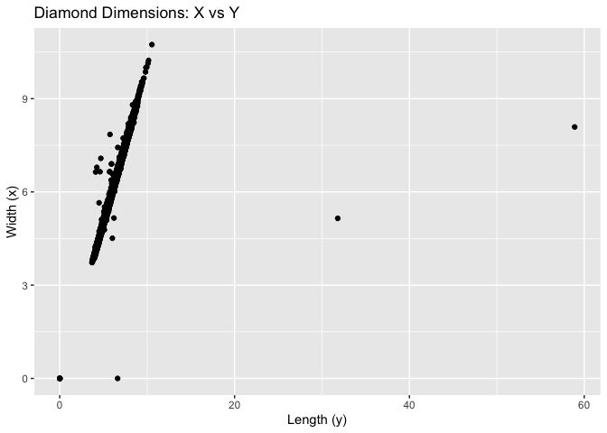
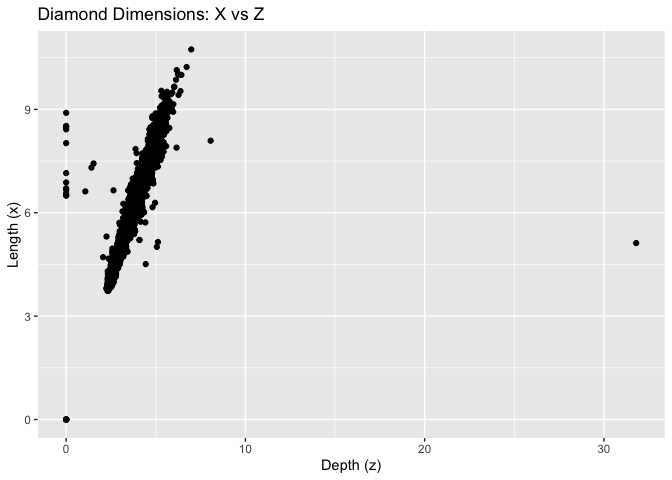
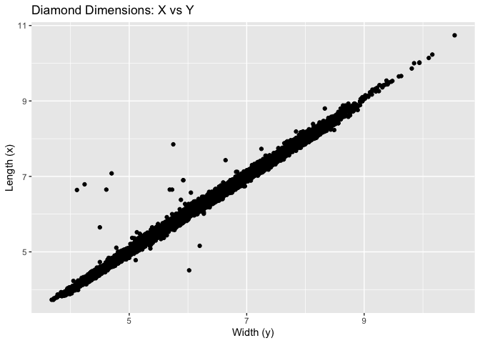
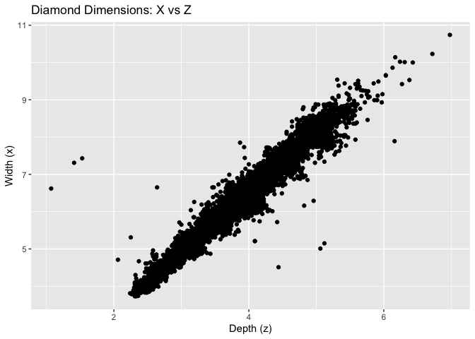

**Homework 5**
================

# Open libraries

``` r
library(tidyverse)
```

    ## ── Attaching packages ─────────────────────────────────────── tidyverse 1.3.0 ──

    ## ✓ ggplot2 3.3.3     ✓ purrr   0.3.4
    ## ✓ tibble  3.0.6     ✓ dplyr   1.0.4
    ## ✓ tidyr   1.1.2     ✓ stringr 1.4.0
    ## ✓ readr   1.4.0     ✓ forcats 0.5.1

    ## ── Conflicts ────────────────────────────────────────── tidyverse_conflicts() ──
    ## x dplyr::filter() masks stats::filter()
    ## x dplyr::lag()    masks stats::lag()

``` r
#glimpse(diamonds)
```

# Step 1: Data frame manipulation

Print a data frame that contains the simple count of diamonds in each
“cut” (“Fair”, “Good”, etc.)

``` r
diamonds %>%
  group_by(cut) %>%
  count()
```

    ## # A tibble: 5 x 2
    ## # Groups:   cut [5]
    ##   cut           n
    ##   <ord>     <int>
    ## 1 Fair       1610
    ## 2 Good       4906
    ## 3 Very Good 12082
    ## 4 Premium   13791
    ## 5 Ideal     21551

# Step 2: Subset data

Randomly subset the data to 1% using dplyr functions.

``` r
subset_diamonds <- sample_frac(diamonds, 0.01)
head(subset_diamonds)
```

    ## # A tibble: 6 x 10
    ##   carat cut       color clarity depth table price     x     y     z
    ##   <dbl> <ord>     <ord> <ord>   <dbl> <dbl> <int> <dbl> <dbl> <dbl>
    ## 1  1.23 Premium   G     VS2      61.1    57  8128  6.96  6.91  4.24
    ## 2  1.63 Very Good I     SI1      62      54  9090  7.6   7.67  4.73
    ## 3  3.65 Fair      H     I1       67.1    53 11668  9.53  9.48  6.38
    ## 4  0.31 Very Good F     VS2      62.9    59   625  4.27  4.32  2.7 
    ## 5  1.03 Very Good F     VVS2     61.5    55  8998  6.48  6.57  4.01
    ## 6  1.26 Very Good F     IF       60      60 14095  7.04  7.09  4.24

# Step 3: Calculation

Calculate the average size of the largest 100 diamonds in each clarity
category.

``` r
diamonds %>%
  group_by(clarity) %>%
  count()
```

    ## # A tibble: 8 x 2
    ## # Groups:   clarity [8]
    ##   clarity     n
    ##   <ord>   <int>
    ## 1 I1        741
    ## 2 SI2      9194
    ## 3 SI1     13065
    ## 4 VS2     12258
    ## 5 VS1      8171
    ## 6 VVS2     5066
    ## 7 VVS1     3655
    ## 8 IF       1790

``` r
#Large diamonds
large_diamonds <- diamonds %>%
  arrange(desc(carat)) %>%
  group_by(clarity) %>%
  slice(1:100)
large_diamonds
```

    ## # A tibble: 800 x 10
    ## # Groups:   clarity [8]
    ##    carat cut       color clarity depth table price     x     y     z
    ##    <dbl> <ord>     <ord> <ord>   <dbl> <dbl> <int> <dbl> <dbl> <dbl>
    ##  1  5.01 Fair      J     I1       65.5    59 18018 10.7  10.5   6.98
    ##  2  4.5  Fair      J     I1       65.8    58 18531 10.2  10.2   6.72
    ##  3  4.13 Fair      H     I1       64.8    61 17329 10     9.85  6.43
    ##  4  4.01 Premium   I     I1       61      61 15223 10.1  10.1   6.17
    ##  5  4.01 Premium   J     I1       62.5    62 15223 10.0   9.94  6.24
    ##  6  4    Very Good I     I1       63.3    58 15984 10.0   9.94  6.31
    ##  7  3.67 Premium   I     I1       62.4    56 16193  9.86  9.81  6.13
    ##  8  3.65 Fair      H     I1       67.1    53 11668  9.53  9.48  6.38
    ##  9  3.5  Ideal     H     I1       62.8    57 12587  9.65  9.59  6.03
    ## 10  3.4  Fair      D     I1       66.8    52 15964  9.42  9.34  6.27
    ## # … with 790 more rows

``` r
#Calculate average size
large_diamonds %>%
  group_by(clarity) %>%
  summarise(average.size = mean(carat, na.rm = T))
```

    ## # A tibble: 8 x 2
    ##   clarity average.size
    ## * <ord>          <dbl>
    ## 1 I1              2.51
    ## 2 SI2             2.62
    ## 3 SI1             2.30
    ## 4 VS2             2.23
    ## 5 VS1             2.10
    ## 6 VVS2            1.66
    ## 7 VVS1            1.51
    ## 8 IF              1.40

# Step 4: Scatterplots

Scatterplot 1: a plot of the x dimension vs the y dimension Scatterplot
2: a plot of the x dimension vs the z dimension

``` r
ggplot(diamonds) +
  geom_point(aes(x = y, y = x)) +
  labs(title = "Diamond Dimensions: X vs Y", x = "Width (y)", y = "Length (x)")
```

<!-- -->

``` r
ggplot(diamonds) +
  geom_point(aes(x = z, y = x)) +
  labs(title = "Diamond Dimensions: X vs Z", x = "Depth (z)", y = "Length (x)")
```

<!-- -->

``` r
#Note that there are suspicious data points
```

# Step 5: Remove suspicious data points and re-plot data

``` r
# X vs Y
diamonds_xy <- diamonds %>%
  filter(x > 3 & y < 20)
ggplot(diamonds_xy) +
  geom_point(aes(x = y, y = x)) +
  labs(title = "Diamond Dimensions: X vs Y", x = "Width (y)", y = "Length (x)")
```

<!-- -->

``` r
#  X vs Z
diamond_xz <- diamonds %>%
  filter(x > 3 & z < 8 & z > 1)
ggplot(diamond_xz) +
  geom_point(aes(x = z, y = x)) +
  labs(title = "Diamond Dimensions: X vs Z", x = "Depth (z)", y = "Length (x)")
```

<!-- -->
